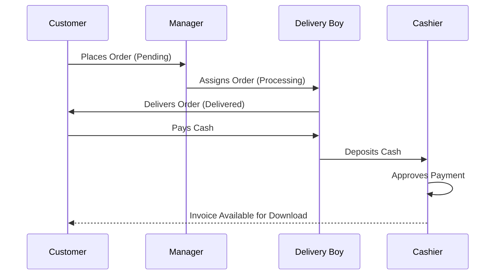

# Software Requirements Specification (SRS)
## Project: CoolStock - Ice Cream Wholesale Management System

**Version:** 1.1  
**Status:** Final Draft  
**Date:** April 1, 2026  
**Authors:** Rutvik Shiyal, Yash Kacha, Gracy Pandya

---

## 1. Introduction

### 1.1 Purpose
The purpose of this document is to provide a comprehensive description of the software requirements for the **CoolStock Ice Cream Wholesale Management System**. This system is designed to automate and streamline the supply chain operations of an ice cream wholesale distributor, connecting administrators, managers, delivery personnel, cashiers, and B2B customers (retail shop owners).

### 1.2 Scope
CoolStock is a Java-based web application (Spring Boot + JSP) that facilitates:
*   **Centralized Inventory Management:** Real-time tracking of ice cream stock.
*   **Role-Based Access Control (RBAC):** Tailored dashboards for five distinct user roles.
*   **Order Lifecycle Management:** From digital placement to physical delivery and payment verification.
*   **Automated Invoicing:** Generating digital bills upon successful transaction completion.

### 1.3 Definitions, Acronyms, and Abbreviations
*   **SRS:** Software Requirements Specification
*   **RBAC:** Role-Based Access Control
*   **B2B:** Business-to-Business
*   **JSP:** JavaServer Pages
*   **MVC:** Model-View-Controller
*   **JPA:** Java Persistence API
*   **POS:** Point of Sale

### 1.4 References
*   IEEE Std 830-1998, IEEE Recommended Practice for Software Requirements Specifications.
*   Project Technical Stack: Spring Boot, MySQL, Maven, Tailwind CSS.

---

## 2. Overall Description

### 2.1 Product Perspective
CoolStock is a standalone web-based ERP (Enterprise Resource Planning) tool specifically tailored for the ice cream wholesale industry. It replaces manual ledgers and fragmented communication with a unified database-driven platform.

### 2.2 User Classes and Characteristics

| Role | Description | Key Responsibilities |
| :--- | :--- | :--- |
| **Admin** | System Head / Owner | Manage staff (hiring/firing), view global analytics, oversee master inventory and customers. |
| **Manager** | Branch / Warehouse Coordinator | Process incoming orders, assign tasks to delivery boys, monitor stock levels. |
| **Delivery Boy** | Logistics Executor | Deliver orders to customers, update delivery status, collect cash payments. |
| **Cashier** | Financial Accountant | Verify cash deposits from delivery boys, generate invoices, handle walk-in sales. |
| **Customer** | B2B Client (Retailer) | Place bulk orders in cartons, track order status, download invoices. |

### 2.3 Operating Environment
*   **Platform:** Web-based (Cross-platform)
*   **Backend:** Java 17+, Spring Boot 3.x
*   **Frontend:** JSP, Bootstrap/Tailwind CSS, JavaScript
*   **Database:** MySQL 8.0+
*   **Server:** Embedded Tomcat (Development), AWS/DigitalOcean (Production target)

### 2.4 Design and Implementation Constraints
*   **Language:** Must be written in Java for the backend.
*   **Database:** Must use a relational database (MySQL).
*   **Connectivity:** Requires active internet/local network for server-client communication.

### 2.5 Assumptions and Dependencies
*   Users have basic knowledge of operating a web browser.
*   The system assumes a stable network connection for real-time status updates.
*   Dependency on Maven for library and dependency management.

---

## 3. System Features

### 3.1 Authentication & RBAC (REQ-1)
*   **Description:** Secure login system that redirects users to their specific dashboard based on their role (`Admin`, `Manager`, `Customer`, `DeliveryBoy`, `Cashier`).
*   **Functional Requirements:**
    *   The system shall validate credentials against the MySQL database.
    *   The system shall maintain session security to prevent unauthorized access to role-specific pages.
    *   The system shall provide a multi-role login interface (`login.jsp`).

### 3.2 User Profile Management (REQ-2)
*   **Description:** Every user role has a dedicated profile page to view and update personal information.
*   **Functional Requirements:**
    *   Users shall be able to upload and update a profile picture.
    *   Users shall be able to edit contact details (Phone, Email, Shop Address for Customers).
    *   Admin shall view employee profile photos to verify identity during recruitment/oversight.

### 3.3 Customer Order Workflow (REQ-3)
*   **Description:** The core business logic for processing bulk ice cream orders.
*   **Functional Requirements:**
    *   **Placement:** Customers shall place orders in "Cartons" or units via a digital catalog.
    *   **Tracking:** Customers shall see real-time status updates: `Pending` → `Processing` → `Out for Delivery` → `Delivered` → `Paid`.
    *   **Invoice Download:** Customers shall download a PDF invoice once the Cashier approves the payment.

### 3.4 Managerial Oversight & Assignment (REQ-4)
*   **Description:** Logistics coordination by the Branch Manager.
*   **Functional Requirements:**
    *   Managers shall receive notifications for new `Pending` orders.
    *   Managers shall assign orders to available `Delivery Boys`.
    *   Managers shall have the authority to `Approve` or `Reject` orders based on stock availability.

### 3.5 Delivery & Fulfillment (REQ-5)
*   **Description:** On-ground operations by Delivery Personnel.
*   **Functional Requirements:**
    *   Delivery Boys shall see a personalized list of `Assigned` orders.
    *   Delivery Boys shall update the status to `Out for Delivery` when leaving the warehouse.
    *   Delivery Boys shall mark orders as `Delivered` and record the cash collection amount.

### 3.6 Financial Settlement & Invoicing (REQ-6)
*   **Description:** Payment verification by the Cashier.
*   **Functional Requirements:**
    *   Cashiers shall verify the cash deposited by Delivery Boys.
    *   The system shall associate the **Cashier's User ID** with the order once payment is confirmed.
    *   The system shall automatically generate a serialized bill/invoice upon payment confirmation.
    *   Cashiers shall handle direct "Walk-in" sales at the warehouse POS.

### 3.7 Administrative Control (REQ-7)
*   **Description:** High-level system management.
*   **Functional Requirements:**
    *   Admin shall manage "New Join Requests" for employees.
    *   Admin shall have a "View Staff" and "View Customers" module for global audit.
    *   Admin and Managers shall be able to track which Cashier collected payment for any specific order.
    *   Admin shall view summarized reports (Total Sales, Top Products, Active Employees).

---

## 4. External Interface Requirements

### 4.1 User Interfaces
*   **Dashboard Design:** Modern, clean UI using Tailwind CSS.
*   **Responsiveness:** Mobile-first approach for Delivery Boys and Customers.
*   **Navigation:** Sidebars for Admin/Manager; Bottom-nav or Card-based for mobile users.

### 4.2 Software Interfaces
*   **Database:** JDBC or Spring Data JPA for MySQL connectivity.
*   **Reporting:** Possible integration with JasperReports or similar for PDF generation.
*   **Charts:** Chart.js for Admin data visualization.

---

## 5. Non-Functional Requirements

### 5.1 Security
*   Password hashing (BCrypt) for all user accounts.
*   Protection against SQL injection and CSRF.
*   Session timeout for inactive users.

### 5.2 Performance
*   Dashboard pages should load within < 2 seconds on a standard broadband connection.
*   Database queries must be optimized with proper indexing for fast order retrieval.

### 5.3 Availability
*   The system should be designed for 99.9% uptime for business hours (8 AM - 10 PM).

### 5.4 Scalability
*   The database schema (Relational) should support adding multiple branches/warehouses in the future.

---

## 6. Data Requirements

### 6.1 Entity Relationship Summary
*   **Users:** Base entity (Admin, Staff, Customer).
*   **Products:** Item details (Flavor, Category, Price, Stock).
*   **Orders:** Transaction header (CustomerID, Status, Total, Timestamps).
*   **OrderItems:** Transaction details (OrderID, ProductID, Qty, Subtotal).

---

## 7. Operational Workflow (Visual Representation)

---

## 8. Appendix
*   **Database Schema:** Refer to `DATABASE_SCHEMA.sql` for table structures.
*   **Development Roadmap:** Future integration of Google Maps for live GPS tracking.
